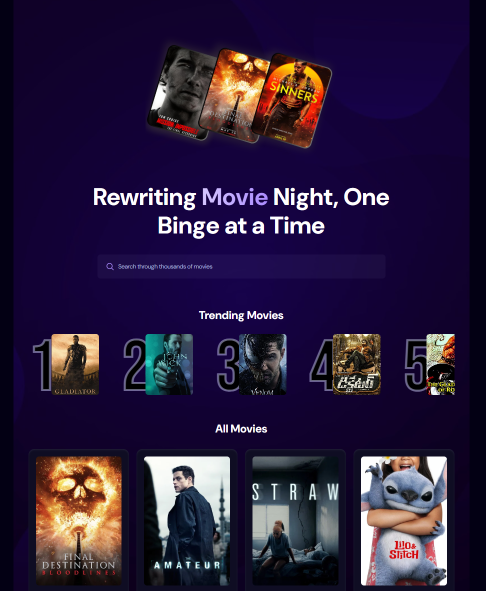

<div align="center">
  <br />
    <a>
      
    </a>
  <br />
  
  <div>
    
    
    
  </div>

  <h3 align="center">A Movie Application</h3>

</div>

## 📋 <a name="table">Table of Contents</a>

1. 🤖 [Introduction](#introduction)
2. ⚙️ [Tech Stack](#tech-stack)
3. 🔋 [Features](#features)
4. 🤸 [Quick Start](#quick-start)

## <a name="introduction">🤖 Introduction</a>

Built with React.js for the user interface, Appwrite for backend services, and styled with TailwindCSS, this Movie App lets users browse trending movies, search titles, and explore content using the TMDB API. It features a responsive layout and a sleek, modern design.


## <a name="tech-stack">⚙️ Tech Stack</a>

- **[Appwrite](https://appwrite.io/)** 

- **[React.js](https://react.dev/reference/react)** 

- **[React-use](https://github.com/streamich/react-use)** 

- **[Tailwind CSS](https://tailwindcss.com/)** 

- **[Vite](https://vite.dev/)**


## <a name="features">🔋 Features</a>

⭐️ **Browse All Movies**: Explore a wide range of movies available on the platform.

⭐️ **Search Movies**: Easily search for specific movies using a search function.

⭐️ **Trending Movies Algorithm**: Displays trending movies based on a dynamic algorithm.

⭐️ **Modern UI/UX**: A sleek and user-friendly interface designed for a great experience.

⭐️ **Responsiveness**: Fully responsive design that works seamlessly across devices.


## <a name="quick-start">🤸 Quick Start</a>

**1. How to start project**
```bash
cd movieapp2
```


**2. Installation**

Install the project dependencies using npm:

```bash
npm install
```

**3. Set Up Environment Variables**

Key is hidden from public view. Will replace placeholder for demo when requested. Otherwise can use your own keys.

```env
VITE_TMDB_API_KEY=

VITE_APPWRITE_PROJECT_ID=
VITE_APPWRITE_DATABASE_ID=
VITE_APPWRITE_COLLECTION_ID=
```

Replace the placeholder values with your actual **[TheMovieDatabase API](https://developer.themoviedb.org/reference/intro/getting-started)** and **[Appwrite](https://apwr.dev/JSM050)** credentials.

**4. Running the Project**

```bash
npm run dev
```

Open [http://localhost:5173](http://localhost:5173) in your browser to view the project.

